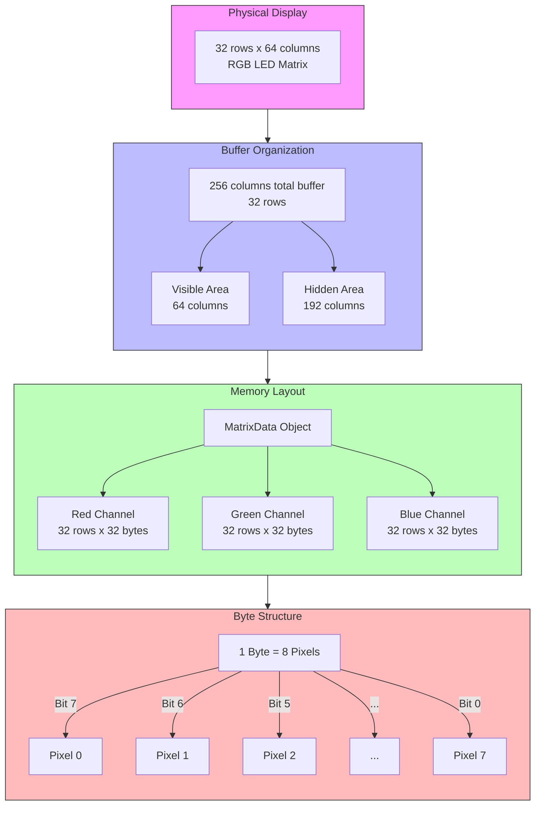

```mermaid
flowchart TB
    subgraph Physical [Physical Display]
        direction TB
        disp[32 rows x 64 columns<br>RGB LED Matrix]
    end

    Physical --> Buffer

    subgraph Buffer [Buffer Organization]
        direction TB
        buf[256 columns total buffer<br>32 rows]
        buf --> vis[Visible Area<br>64 columns]
        buf --> hid[Hidden Area<br>192 columns]
    end

    Buffer --> Memory

    subgraph Memory [Memory Layout]
        direction TB
        mem[MatrixData Object]
        mem --> red[Red Channel<br>32 rows x 32 bytes]
        mem --> green[Green Channel<br>32 rows x 32 bytes]
        mem --> blue[Blue Channel<br>32 rows x 32 bytes]
    end

    Memory --> Bytes

    subgraph Bytes [Byte Structure]
        direction TB
        byte[1 Byte = 8 Pixels]
        byte --> |Bit 7|p7[Pixel 0]
        byte --> |Bit 6|p6[Pixel 1]
        byte --> |Bit 5|p5[Pixel 2]
        byte --> |...|p4[...]
        byte --> |Bit 0|p0[Pixel 7]
    end

    style Physical fill:#f9f,stroke:#333
    style Buffer fill:#bbf,stroke:#333
    style Memory fill:#bfb,stroke:#333
    style Bytes fill:#fbb,stroke:#333
```