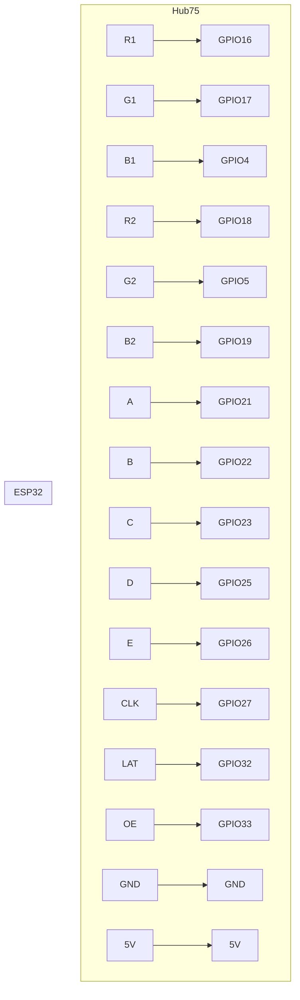

```mermaid
graph TD
    subgraph Hub75
        R1 --> ESP32_GPIO16
        G1 --> ESP32_GPIO17
        B1 --> ESP32_GPIO4
        R2 --> ESP32_GPIO18
        G2 --> ESP32_GPIO5
        B2 --> ESP32_GPIO19
        A --> ESP32_GPIO21
        B --> ESP32_GPIO22
        C --> ESP32_GPIO23
        D --> ESP32_GPIO25
        E --> ESP32_GPIO26
        CLK --> ESP32_GPIO27
        LAT --> ESP32_GPIO32
        OE --> ESP32_GPIO33
        GND --> ESP32_GND
        5V --> ESP32_5V
    end

    subgraph ESP32
        ESP32_GPIO16[GPIO16]
        ESP32_GPIO17[GPIO17]
        ESP32_GPIO4[GPIO4]
        ESP32_GPIO18[GPIO18]
        ESP32_GPIO5[GPIO5]
        ESP32_GPIO19[GPIO19]
        ESP32_GPIO21[GPIO21]
        ESP32_GPIO22[GPIO22]
        ESP32_GPIO23[GPIO23]
        ESP32_GPIO25[GPIO25]
        ESP32_GPIO26[GPIO26]
        ESP32_GPIO27[GPIO27]
        ESP32_GPIO32[GPIO32]
        ESP32_GPIO33[GPIO33]
        ESP32_GND[GND]
        ESP32_5V[5V]
    end
```