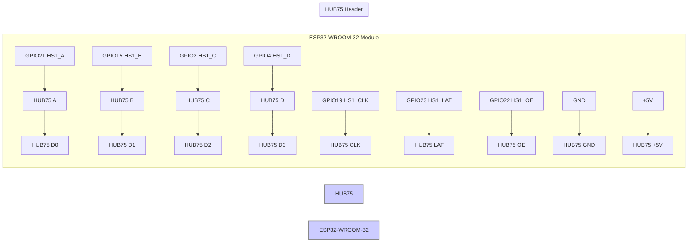

```mermaid
graph LR
    subgraph ESP32-WROOM-32 Module
        A[GPIO16 HS1_D0] --> D0[HUB75 D0]
        B[GPIO17 HS1_D1] --> D1[HUB75 D1]
        C[GPIO5 HS1_D2] --> D2[HUB75 D2]
        D[GPIO18 HS1_D3] --> D3[HUB75 D3]
        E[GPIO19 HS1_CLK] --> CLK[HUB75 CLK]
        F[GPIO23 HS1_LAT] --> LAT[HUB75 LAT]
        G[GPIO22 HS1_OE] --> OE[HUB75 OE]
        H[GPIO21 HS1_A] --> A[HUB75 A]
        I[GPIO15 HS1_B] --> B[HUB75 B]
        J[GPIO2 HS1_C] --> C[HUB75 C]
        K[GPIO4 HS1_D] --> D[HUB75 D]
        L[GND] --> GND[HUB75 GND]
        M[+5V] --> +5V[HUB75 +5V]
    end

    subgraph HUB75 Header
        D0
        D1
        D2
        D3
        CLK
        LAT
        OE
        A
        B
        C
        D
        GND
        +5V
    end

    style HUB75 fill:#ccf,stroke:#888,stroke-width:2px
    style ESP32-WROOM-32 fill:#ccf,stroke:#888,stroke-width:2px
```