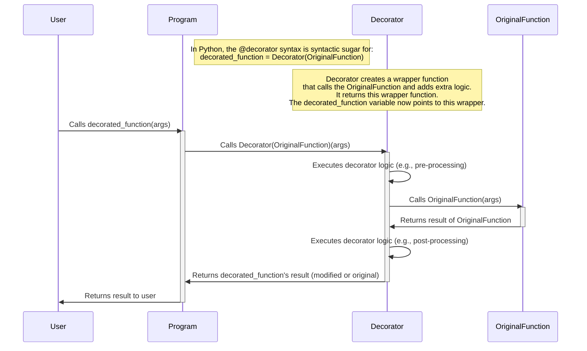

```mermaid
sequenceDiagram
    participant User
    participant Program
    Note right of Program:  In Python, the @decorator syntax is syntactic sugar for:<br>decorated_function = Decorator(OriginalFunction)
    participant Decorator
        Note over Decorator: Decorator creates a wrapper function<br>that calls the OriginalFunction and adds extra logic.<br> It returns this wrapper function.<br>The decorated_function variable now points to this wrapper.
    participant OriginalFunction

    User->>Program: Calls decorated_function(args)
    activate Program
    Program->>Decorator: Calls Decorator(OriginalFunction)(args)
    activate Decorator
    Decorator->>Decorator: Executes decorator logic (e.g., pre-processing)
    Decorator->>OriginalFunction: Calls OriginalFunction(args)
    activate OriginalFunction
    OriginalFunction->>Decorator: Returns result of OriginalFunction
    deactivate OriginalFunction
    Decorator->>Decorator: Executes decorator logic (e.g., post-processing)
    Decorator->>Program: Returns decorated_function's result (modified or original)
    deactivate Decorator
    Program->>User: Returns result to user
    deactivate Program

```

